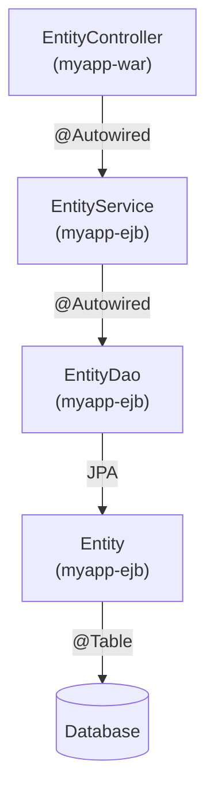

UDA generates applications that follow a strict, well-understood layered architecture. Each layer has a single responsibility, and UDA provides base classes for every layer so that generated code is consistent and minimal.

## Layer overview

<Frame caption="UDA layered architecture: from browser to database">
  
</Frame>

The five layers, from top to bottom:

| Layer | Technology | Base class / artifact |
|---|---|---|
| Presentation | JSP + RUP components (jQuery) | — |
| Web | Spring MVC Controllers | `BaseController` |
| Service | Spring Services | `BaseService` |
| DAO | Spring Data JPA Repositories | `BaseDao` / JPA repository interfaces |
| Domain | JPA Entities | — |

## Maven multi-module project structure

udaPlugin generates a standard Java EE multi-module Maven project. Each module has a defined responsibility:

<Tree>
  <Tree.Folder name="myapp-ear" defaultOpen>
    <Tree.File name="pom.xml" />
    <Tree.Folder name="src/main/application">
      <Tree.File name="application.xml" />
    </Tree.Folder>
  </Tree.Folder>
  <Tree.Folder name="myapp-ejb" defaultOpen>
    <Tree.File name="pom.xml" />
    <Tree.Folder name="src/main/java">
      <Tree.Folder name="com/example/myapp/service">
        <Tree.File name="EntityService.java" />
      </Tree.Folder>
      <Tree.Folder name="com/example/myapp/dao">
        <Tree.File name="EntityDao.java" />
      </Tree.Folder>
      <Tree.Folder name="com/example/myapp/domain">
        <Tree.File name="Entity.java" />
      </Tree.Folder>
    </Tree.Folder>
  </Tree.Folder>
  <Tree.Folder name="myapp-war" defaultOpen>
    <Tree.File name="pom.xml" />
    <Tree.Folder name="src/main/java">
      <Tree.Folder name="com/example/myapp/web">
        <Tree.File name="EntityController.java" />
      </Tree.Folder>
    </Tree.Folder>
    <Tree.Folder name="src/main/webapp/WEB-INF/views">
      <Tree.File name="entity/entity.jsp" />
    </Tree.Folder>
  </Tree.Folder>
  <Tree.Folder name="myapp-static" defaultOpen>
    <Tree.File name="pom.xml" />
    <Tree.Folder name="src/main/webapp">
      <Tree.Folder name="css">
        <Tree.File name="rup.min.css" />
      </Tree.Folder>
      <Tree.Folder name="js">
        <Tree.File name="rup.min.js" />
      </Tree.Folder>
    </Tree.Folder>
  </Tree.Folder>
</Tree>

<AccordionGroup>
  <Accordion title="myapp-ear — Enterprise Application">
    The top-level packaging module. It bundles the EJB and WAR modules into a deployable `.ear` archive for Java EE application servers (JBoss/WildFly, WebLogic, etc.). Contains the `application.xml` descriptor that references the other modules.
  </Accordion>
  <Accordion title="myapp-ejb — Business logic">
    Contains the service layer, DAO layer, and domain entities. Deployed as an EJB module within the EAR. Spring beans defined here are injected into the WAR module's controllers via the shared Spring application context.
  </Accordion>
  <Accordion title="myapp-war — Web module">
    Contains Spring MVC controllers, JSP views, and web configuration (`web.xml`, Spring MVC dispatcher servlet config). This module handles all HTTP traffic and delegates to EJB-module services.
  </Accordion>
  <Accordion title="myapp-static — Static resources">
    A separate WAR module that serves the RUP JavaScript and CSS files. Keeping static resources in their own module simplifies caching configuration and allows independent deployment or CDN offloading.
  </Accordion>
</AccordionGroup>

## Layer details

### Presentation layer

JSP views render the initial HTML page and include RUP component declarations. RUP components are initialised via JavaScript and take over the dynamic behaviour of the page—form submission, table pagination, autocomplete, etc.—without full page reloads.

```jsp presentation layer — entity.jsp (excerpt)
<%@ taglib prefix="spring" uri="http://www.springframework.org/tags" %>
<%@ taglib prefix="rup" uri="/WEB-INF/tld/rup.tld" %>

<rup:table id="entityTable"
    url="${pageContext.request.contextPath}/entity/search"
    formId="entitySearchForm"
    columns="[{data:'id'},{data:'name'},{data:'description'}]" />
```

### Web layer — BaseController

Every generated controller extends `BaseController` from udaLib. `BaseController` provides:

- Access to the Spring Security context (current user, roles)
- Standard error handling and response formatting
- Logging hooks
- Helper methods for building Spring MVC `Model` attributes

```java web layer — BaseController pattern
@Controller
public abstract class BaseController {
    // Common controller functionality provided by udaLib:
    // - CRUD operation helpers
    // - Security context access
    // - Structured logging
    // - Standard error response formatting
}

@Controller
@RequestMapping("/entity")
public class EntityController extends BaseController {

    @Autowired
    private EntityService entityService;

    @RequestMapping(method = RequestMethod.GET)
    public String index(Model model) {
        return "entity/entity";  // resolves to /WEB-INF/views/entity/entity.jsp
    }
}
```

### Service layer — BaseService

Services encapsulate business logic and transaction boundaries. Generated services extend `BaseService`, which provides transaction management scaffolding and integration with the UDA logging infrastructure.

```java service layer — BaseService pattern
public abstract class BaseService {
    // Transaction management, logging, and cross-cutting service utilities
}

@Service
@Transactional
public class EntityService extends BaseService {

    @Autowired
    private EntityDao entityDao;

    public Entity findById(Long id) {
        return entityDao.findById(id)
            .orElseThrow(() -> new EntityNotFoundException(id));
    }

    public DataTablesOutput<EntityDto> findAll(DataTablesInput input) {
        return entityDao.findAll(input, EntityDto.class);
    }
}
```

### DAO layer — BaseDao and JPA repositories

The DAO layer abstracts database access. UDA supports two patterns depending on project configuration:

<Tabs>
  <Tab title="Spring Data JPA repository">
    ```java Spring Data JPA — recommended for new projects
    public interface EntityDao extends JpaRepository<Entity, Long>,
            JpaSpecificationExecutor<Entity> {
        // Spring Data generates all standard CRUD methods automatically.
        // Custom queries use @Query or Specification.
        List<Entity> findByNameContaining(String name);
    }
    ```
  </Tab>
  <Tab title="BaseDao (classic pattern)">
    ```java BaseDao — used in older UDA project generations
    public abstract class BaseDao<T, ID> {
        // Common JPA EntityManager operations:
        // findById, findAll, persist, merge, remove
        // Subclasses add entity-specific queries.
    }

    @Repository
    public class EntityDaoImpl extends BaseDao<Entity, Long>
            implements EntityDao {

        public List<Entity> findByName(String name) {
            // JPQL or Criteria API query
        }
    }
    ```
  </Tab>
</Tabs>

### Domain layer — JPA entities

Domain entities are plain JPA-annotated POJOs. UDA generates standard `@Entity` classes with primary key, basic fields, and optional relationships. No framework-specific base class is required at this layer.

```java domain layer — JPA entity
@Entity
@Table(name = "T_ENTITY")
public class Entity {

    @Id
    @GeneratedValue(strategy = GenerationType.SEQUENCE,
                    generator = "SEQ_ENTITY")
    @SequenceGenerator(name = "SEQ_ENTITY",
                       sequenceName = "SEQ_ENTITY", allocationSize = 1)
    private Long id;

    @Column(name = "NAME", nullable = false, length = 100)
    private String name;

    @Column(name = "DESCRIPTION", length = 500)
    private String description;

    // Getters and setters...
}
```

## Entity / service / controller relationship

The complete vertical dependency chain for a single domain object:



<Note>
  Controllers live in `myapp-war`; services, DAOs, and entities live in `myapp-ejb`. Spring's cross-module dependency injection wires them together at deployment time inside the EAR.
</Note>
