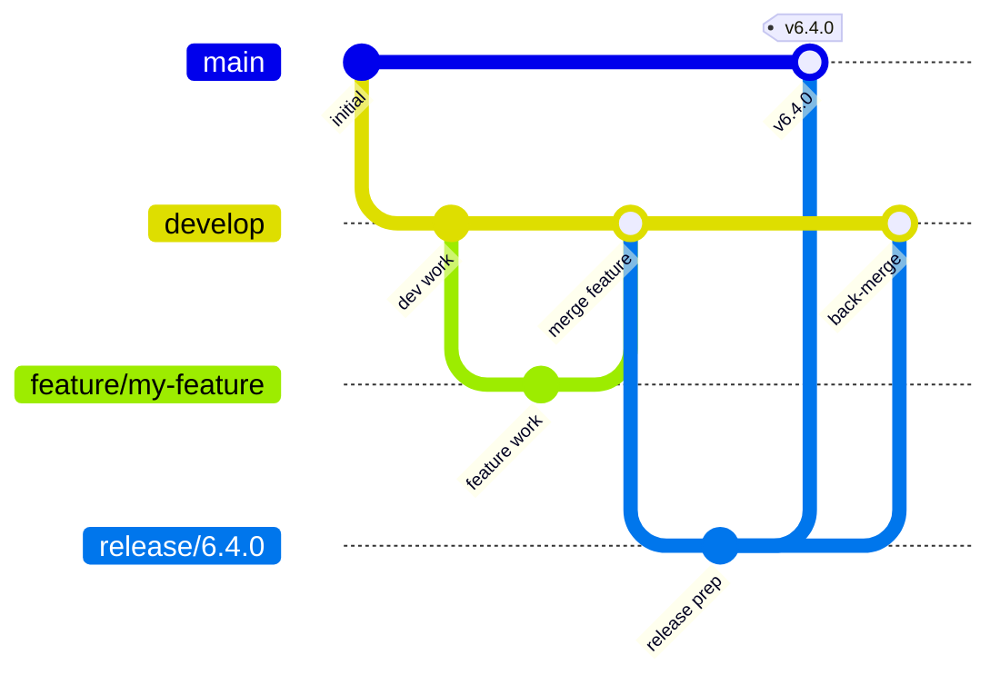

UDA repositories follow the [GitFlow](https://nvie.com/posts/a-successful-git-branching-model/) branching model. Understanding this workflow helps you contribute effectively and understand how releases are coordinated.

## Branch strategy

| Branch | Purpose |
|--------|---------|
| `main` / `master` | Stable, tagged releases only. Never commit directly to this branch. |
| `develop` | Integration branch. All completed features merge here before a release. |
| `feature/xxx` | New features and non-urgent improvements. Branches off `develop`. |
| `release/x.y.z` | Release preparation. Branched from `develop` when a release is ready for final testing. |
| `hotfix/xxx` | Urgent fixes for production issues. Branches off `main` and merges back to both `main` and `develop`. |



---

## Version naming convention

UDA versions follow [Semantic Versioning](https://semver.org/): **MAJOR.MINOR.PATCH**

| Segment | Meaning |
|---------|---------|
| MAJOR | Significant architectural changes or breaking compatibility |
| MINOR | New features, backward compatible |
| PATCH | Bug fixes and minor improvements |

**Examples:** `6.4.0`, `5.4.2`, `4.5.4`

### Tag format

Git tags use a `v` prefix followed by the version number: `v6.4.0`, `v5.4.2`, `v4.5.4`.

---

## Release cadence

- **Major releases** roughly once per year, aligned with significant dependency upgrades (e.g., a new Eclipse release train or Spring generation).
- **Minor releases** when meaningful new features are ready.
- **Patch releases** as needed for bug fixes, with no fixed schedule.

---

## Contributing: fork and PR workflow

<Steps>
  <Step title="Fork the repository">
    Fork the target repository on GitHub to your personal account.
  </Step>
  <Step title="Create a feature branch from develop">
    ```bash
    git clone https://github.com/YOUR_USERNAME/REPO_NAME.git
    cd REPO_NAME
    git checkout develop
    git checkout -b feature/your-feature-name
    ```
  </Step>
  <Step title="Develop and commit your changes">
    Write your code and commit with clear, descriptive messages.
    ```bash
    git add .
    git commit -m "Add support for XYZ"
    ```
  </Step>
  <Step title="Push and open a pull request">
    ```bash
    git push origin feature/your-feature-name
    ```
    Open a pull request on GitHub targeting the upstream `develop` branch. Describe the change and link to any related issues.
  </Step>
</Steps>

<Note>
  Pull requests to `main` are not accepted directly. Always target `develop`. The maintainers will merge to `main` as part of the release process.
</Note>
